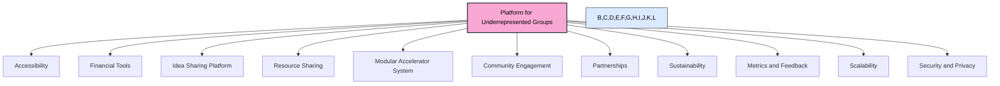

# Vision to Idea: A Place Where Your Dream Becomes an Idea

The **Vision to Idea suite, developed by MBTQ.dev,** is a multi-tenant Software-as-a-Service (SaaS) platform designed to help anyone turn a vision into a structured idea proposal, using an interactive, mind-map-style interface called the Aura Canvas. It empowers organizations—like workforce partners, incubators, or Vocational Rehabilitation agencies VENDER run by deaf t3eam such as **VR4Deaf.org**—to offer their clients a guided path from concept to a formal plan ready for review and approval. It serves as a comprehensive support platform designed to empower underrepresented groups through a **Modular Accelerator System**.

## Production Architecture: API Hub Model

The application is architected to use a secure, scalable client-server model. All AI processing and sensitive API key management is handled by a backend **API Hub**, which is a Node.js Express server. The architecture supports advanced features like sign language video processing and persistent user state.

-   **Frontend (Thin Client):** The React application is responsible for the user interface. It sends requests to the backend for all AI-related tasks.
-   **Backend (API Hub):** A centralized Node.js server is responsible for all business logic, AI processing, secure integrations, and state management. It is the only component with access to the Google Gemini API key.
-   **Deployment:** The frontend and backend are bundled into a single Docker container, which can be deployed as one service to Google Cloud Run.

```mermaid
graph TD
    subgraph User's Browser
        A[React App] -->|1. User interacts| B(API Request)
        B -->|2. POST /api/...| C[Backend API Hub]
    end

    subgraph Secure Cloud Backend (Google Cloud Run)
        C -- HTTPS Request --> C
        C -->|3. Securely calls AI| E[Google Gemini API]
        E -->|4. Returns data| C
    end
    
    C -->|5. Returns JSON to client| B

    style C fill:#f9a8d4,stroke:#1f2937,stroke-width:2px,color:#000
```

### API Documentation
The API Hub exposes the following endpoints under the `/api` prefix.

| Endpoint | Method | Description |
| :--- | :--- | :--- |
| `/generate-focusing-questions` | `POST` | Accepts a `{dream, user}` object and returns structured focusing questions. |
| `/run-ai-step` | `POST` | A generic endpoint to run any pipeline step. Accepts `{pipelineType, step, payload, user}`. |
| `/generate-pitch-deck` | `POST` | Accepts a `{proposal, user}` object and returns a full pitch deck structure. |


---

## Automated Deployment with GitHub Actions

This project is configured for continuous deployment to Google Cloud Run using GitHub Actions. Every push to the `main` branch automatically builds and deploys the latest version of the application. The unified `Dockerfile` builds both the frontend and backend into a single image.

### Workflow

1.  **Trigger:** A `git push` to the `main` branch.
2.  **Build:** GitHub Actions builds a Docker image of the application using the provided `Dockerfile`. This Dockerfile first builds the static React app, then builds the Node.js server, and finally combines them into a production image.
3.  **Push:** The image is pushed to a private Google Artifact Registry repository.
4.  **Deploy:** The new image is deployed to the Google Cloud Run service.

### Setup

To enable this automated workflow for your own fork or project, you need to:

1.  **Enable Google Cloud APIs:** In your Google Cloud project, make sure the following APIs are enabled:
    *   Cloud Run API (`run.googleapis.com`)
    *   Artifact Registry API (`artifactregistry.googleapis.com`)
    *   Cloud Build API (`cloudbuild.googleapis.com`)

2.  **Create an Artifact Registry Repository:**
    *   Run the command:
        ```bash
        gcloud artifacts repositories create vision-to-idea --repository-format=docker --location=us-central1 --description="Docker repository for Vision to Idea"
        ```
    *   *(Replace `us-central1` with your preferred region if needed, and update `.github/workflows/deploy.yml` accordingly.)*

3.  **Create a Service Account:**
    *   Create a service account with the necessary permissions: `Cloud Run Admin`, `Artifact Registry Writer`, `Storage Admin`, `Service Account User`.
    *   Create and download a JSON key for this service account.

4.  **Configure GitHub Secrets:**
    *   In your GitHub repository, go to `Settings > Secrets and variables > Actions`.
    *   Create the following repository secrets:
        *   `GCP_PROJECT_ID`: Your Google Cloud Project ID.
        *   `GCP_SA_KEY`: The entire content of the JSON service account key you downloaded.
        *   `API_KEY`: Your Google Gemini API Key. This will be securely passed to the Cloud Run service as an environment variable.

Once these secrets are in place, the workflow in `.github/workflows/deploy.yml` will run automatically on the next push to `main`.

---

## The 11 Strategic Pillars
The platform is built upon eleven core pillars that work in concert to provide holistic support.

*(The 11 pillars section remains unchanged)*

### 1. Accessibility
Ensuring the platform is usable by everyone, regardless of ability or language.
-   **Mobile-First Design:** The UI is fully responsive and designed to work seamlessly on all devices.
-   **Multilingual Support:** A future goal is to provide multilingual UI and AI assistance to serve a global user base.
-   **Deaf-First Approach:** With integrations like DeafAuth and a focus on visual, video-first flows, the platform prioritizes the needs of the Deaf community.

### 2. Financial Tools
Integrating tools and education to build financial literacy and independence.
-   **User-Friendly Financial Literacy Tools:** Future integrations with services like **PinkSync** will provide users with tools to manage their finances.
-   **Integrated Educational Resources:** The AI can generate financial projections within business plans, and future integrations with **FibonRose** will offer a library of educational content.

### 3. Idea Sharing Platform
Creating a safe and collaborative space for users to share ideas and find support.
-   **Secure, Moderated Platform:** The DeafAuth schema provides the foundation for a secure, role-based community.
-   **Mentorship Programs:** The platform is designed to be used by professional coaches and mentors to assist their clients, foster a collaborative environment.

### 4. Resource Sharing
Building a community where users can offer and request resources.
-   **System for Offering/Requesting Resources:** The proposal generation system is the first step, allowing users to formally request resources from partners.
-   **Foster a 'Pay It Forward' Culture:** By connecting users with support, the platform aims to create a cycle of success and mentorship.

### 5. Modular Accelerator System
Providing tailored, scalable programs for different user needs.
-   **This is the core of the VISION TO IDEA suite.** The application provides distinct, tailored pipelines for various goals.
-   **Scalable and Replicable Model:** The AI-powered pipeline is designed to be easily adapted to new domains and user needs.

### 6. Community Engagement
Empowering users to participate in the platform's governance and direction.
-   **Forums and Voting Systems for Decision-Making:** The "Submit to DAO" feature is the first step toward on-chain governance and community-led decision-making.
-   **Ensure Platform Meets User Needs:** Continuous feedback will be collected to guide development.

### 7. Partnerships
Collaborating with external organizations to provide comprehensive support.
-   **With Financial Institutions, NGOs, and Tech Companies:** The platform is explicitly designed to generate proposals for partners like Vocational Rehabilitation agencies (e.g., **VR4Deaf.org**) and other support organizations.
-   **Provide Capital, Mentorship, and Technological Support:** By creating professional, data-driven proposals, the app facilitates access to these resources.

### 8. Sustainability
Promoting environmentally and socially responsible practices.
-   **Integrate Sustainable Practices and Education:** Future versions of the AI agent can be trained to include sustainability considerations in its business and operational plans.

### 9. Metrics and Feedback
Measuring impact and continuously improving the platform.
-   **Implement Metrics to Measure Impact:** The backend architecture is designed to log events and track success metrics (e.g., proposals funded, businesses started).
-   **Collect Feedback for Continuous Improvement:** User feedback will be a primary driver for platform evolution.

### 10. Scalability
Ensuring the platform can handle a growing user base efficiently.
-   **Use Cloud Services and Edge Computing:** The proposed backend architecture leverages modern, scalable cloud infrastructure.
-   **Handle Growing User Numbers Efficiently:** The decoupled, microservice-based approach ensures that the system can scale individual components as needed.

### 11. Security and Privacy
Prioritizing the protection of user data and privacy.
-   **Prioritize User Security and Privacy:** All architectural designs use a secure backend to protect sensitive data and API keys.
-   **Robust Data Protection Measures:** MBTQ.dev uses **DeafAUTH** for primary authentication and SSO across all ecosystem apps, while **FibonRose** provides an optional ethical and trust verification layer for high-sensitivity workflows or founder/admin approvals. The **DeafAuth** identity model provides a robust, Deaf-centric approach to user authentication and data management.

### 12. The AuraWeaver: The Constellation of Ancestors

A unique feature of the Vision to Idea suite is the **AuraWeaver**. This is more than just a help system; it's a connection to the collective wisdom of the community.

-   **What it is:** The AuraWeaver is a specialized AI agent that constantly and passively observes the anonymized, successful journeys of all users. When a user gets a job, secures funding, or launches a project, the AuraWeaver captures the essence of that journey and weaves it into a "Success Constellation."
-   **How it works:** When a user feels stuck or uncertain, they can invoke the AuraWeaver. Instead of giving direct commands, it tells anonymized, narrative stories of how others in similar situations found success. It reveals the paths of anonymous "ancestors" who walked a similar road, turning their success into a guiding light.
-   **Our Philosophy:** This transforms the system from a mere tool into a living community, where every user's success contributes to a legacy of wisdom that empowers the next generation.

---

## Platform Strategic Overview



---

## Core Data Models

### DeafAuth User Profile Schema
```json
{
  "id": "UUID",
  "email": "string (unique)",
  "username": "string (unique)",
  "sign_lang": "string (e.g. ASL, BSL)",
  "deaf_identity": "string (e.g. Deaf, Hard-of-Hearing, CODA)",
  "auth_method": "string (passwordless, OAuth, biometric, etc)",
  "roles": ["user", "admin", "moderator", "coach", "client"],
  "pinksync_ready": true,
  "fibonrose_badge": "string (e.g. Verified, Advocate)",
  "created_at": "timestamp"
}
```

---

## Changelog
**v3.0.0**
- Implemented the secure API Hub architecture. All AI calls are now routed through a backend Node.js server.
- Refactored `services/apiClient.ts` to be a thin client using `fetch`.
- Added a unified `Dockerfile` for easy deployment of both frontend and backend to Cloud Run.
- Removed all Gemini API logic and keys from the frontend, making the application production-ready and secure.

**v2.1.0**
- Refactored state management to be backend-driven instead of using `localStorage`.
- Application now automatically saves progress after each step and restores it on login, enabling cross-device persistence.

**v2.0.0**
- Implemented distinct user workflows: a video-first "Vision Board" for sign language users and a classic text form.
- Added `SignLanguageInputModal` to provide a high-fidelity simulation of a sign language-to-text AI model.
- Updated authentication flow to allow users to choose their preferred input method at login.

**v1.0.0**
- Refactored to a client-server architecture with a simulated API Hub (`apiClient.ts`).
- Removed all direct AI logic and API keys from the frontend for security and scalability.
- Finalized UI for all four pipelines and DAO submission modal.

**v0.3.0**
- Implemented all four distinct user pipelines (Career, Business, Self-Employment, Agent).
- Created dynamic Step components and a pipeline selection screen.

**v0.2.0**
- Built the initial end-to-end "Career Development" pipeline.
- Implemented client-side Gemini API calls with structured JSON responses.

**v0.1.0**
- Project initialization and UI scaffolding.
- Defined core application structure and branding.
